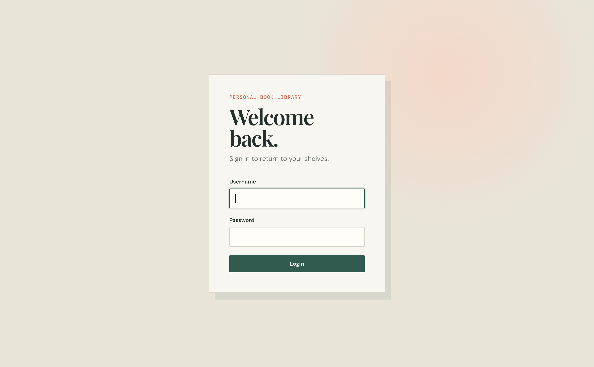
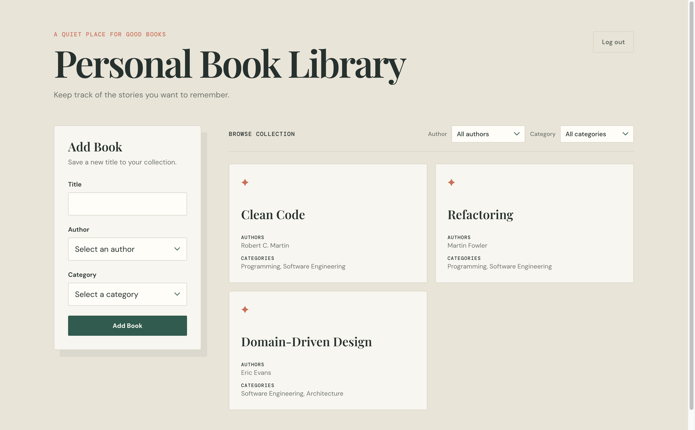
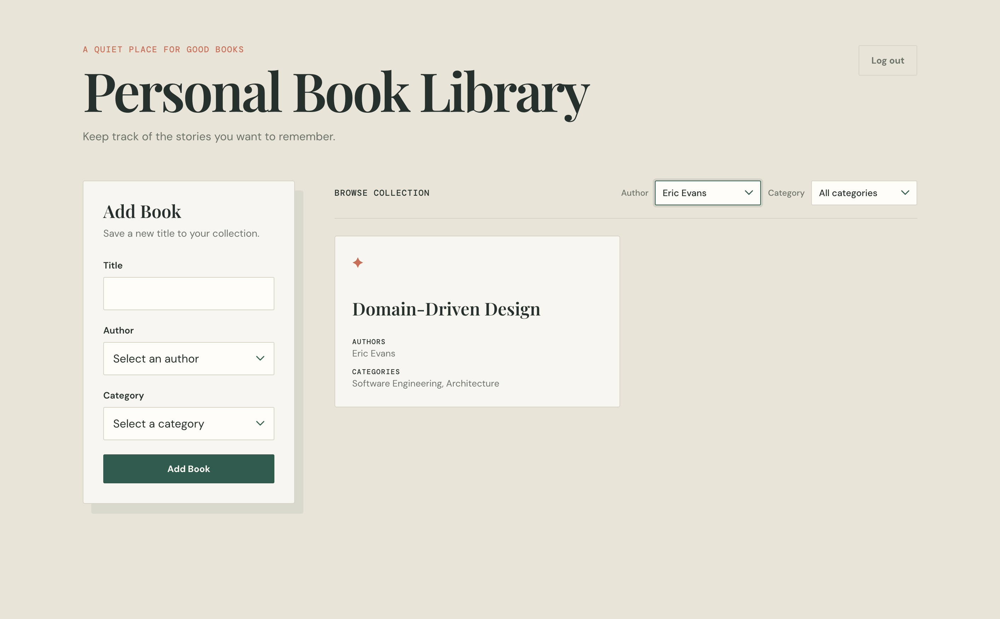

# Personal Book Library

A full-stack personal book library application built with React, TypeScript, Fastify, PostgreSQL, and Drizzle ORM.

The application allows authenticated users to browse books, filter books by author or category, add new books, and delete books.

## Features

- User authentication with JWT
- Protected API endpoints
- View all books
- Filter books by author
- Filter books by category
- Add books with multiple authors and categories
- Delete books
- Loading and error states
- Responsive UI
- REST API
- PostgreSQL database
- Database migrations and seed data

## Tech Stack

### Frontend

- React
- TypeScript
- Vite
- React Router
- Axios
- CSS

### Backend

- Node.js
- TypeScript
- Fastify
- JWT
- Zod
- Drizzle ORM
- PostgreSQL

### Development

- Bruno for API testing
- Git / GitHub

## Architecture

The project is separated into frontend and backend applications.

```text
personal-book-library/
├── frontend/
│   └── src/
│       ├── api/
│       ├── auth/
│       ├── components/
│       ├── pages/
│       ├── routes/
│       └── types/
│
└── backend/
    └── src/
        ├── controllers/
        ├── services/
        ├── repositories/
        ├── routes/
        ├── schemas/
        └── db/
```

### Backend request flow

```text
HTTP Request
     ↓
Route
     ↓
Controller
     ↓
Service
     ↓
Repository
     ↓
Drizzle ORM
     ↓
PostgreSQL
```

The frontend communicates with the backend through REST APIs. Authentication is handled using JWT, which is automatically attached to authenticated API requests by an Axios interceptor.

## Database

The database uses PostgreSQL with Drizzle ORM.

Books and categories have a many-to-many relationship, and books and authors also have a many-to-many relationship.

```text
books
  │
  ├── book_authors ─── authors
  │
  └── book_categories ─── categories
```

The database schema is managed through Drizzle migrations.

Seed data is provided for development and testing.

## API

### Authentication

```http
POST /api/login
```

Example request:

```json
{
  "username": "admin",
  "password": "password123"
}
```

Response:

```json
{
  "token": "<jwt>"
}
```

### Get Books

```http
GET /api/books
```

Optional filters:

```http
GET /api/books?authorId=1
GET /api/books?categoryId=1
GET /api/books?authorId=1&categoryId=2
```

### Create Book

```http
POST /api/books
Authorization: Bearer <token>
```

Example:

```json
{
  "title": "Clean Code",
  "authorIds": [1],
  "categoryIds": [1, 2]
}
```

### Delete Book

```http
DELETE /api/books/:id
Authorization: Bearer <token>
```

Successful deletion returns:

```http
204 No Content
```

## Getting Started

### Prerequisites

Make sure you have:

- Node.js
- npm
- PostgreSQL or a PostgreSQL-compatible database
- Git

### 1. Clone the repository

```bash
git clone https://github.com/17nim/personal-book-library.git
cd personal-book-library
```

### 2. Configure the backend

```bash
cd backend
npm install
```

Create a `.env` file:

```env
DATABASE_URL=your_database_url
JWT_SECRET=your_jwt_secret
PORT=3000
```

### 3. Run database migrations

```bash
npm run db:migrate
```

### 4. Seed the database

```bash
npm run db:seed
```

### 5. Start the backend

```bash
npm run dev
```

The backend will run on:

```text
http://localhost:3000
```

### 6. Configure the frontend

Open another terminal:

```bash
cd frontend
npm install
```

Create `.env`:

```env
VITE_API_URL=http://localhost:3000
```

### 7. Start the frontend

```bash
npm run dev
```

The frontend will normally be available at:

```text
http://localhost:5173
```

## API Testing

The API can be tested using Bruno.

Recommended test flow:

```text
Login
  ↓
Get Books
  ↓
Filter Books
  ↓
Create Book
  ↓
Get Books
  ↓
Delete Book
  ↓
Get Books
```

Protected endpoints should also be tested without a valid JWT to verify that they return `401 Unauthorized`.

## Screenshots

### Login



### Book Library



### Filtering



## Environment Variables

### Backend

| Variable       | Description                  |
| -------------- | ---------------------------- |
| `DATABASE_URL` | PostgreSQL connection string |
| `JWT_SECRET`   | Secret used to sign JWTs     |

### Frontend

| Variable       | Description          |
| -------------- | -------------------- |
| `VITE_API_URL` | Backend API base URL |

## Project Status

The application currently supports:

- Authentication
- Book listing
- Author filtering
- Category filtering
- Book creation
- Book deletion
- JWT-protected operations

## License

This project was created for educational and portfolio purposes.
